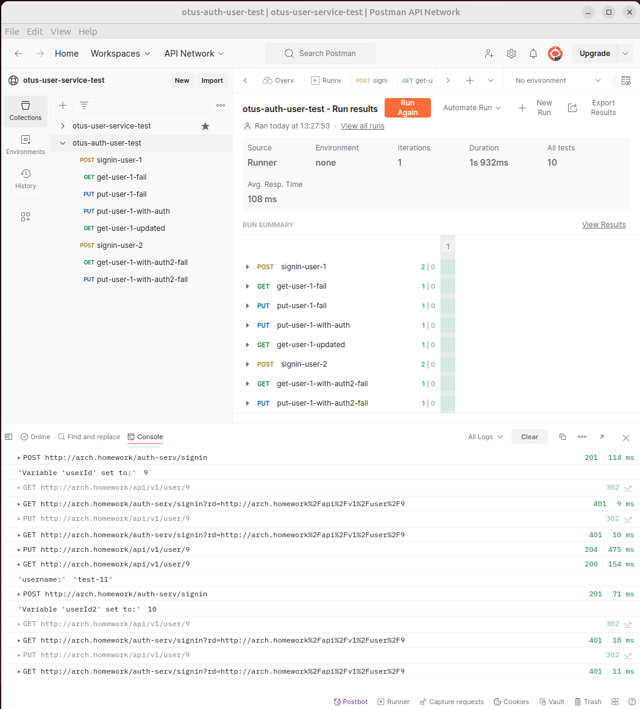

# Отчет по ДЗ "Backend for frontends. Apigateway"

Модифицирован helm оставшийся от предыдущих коммитов.  
Изменения можно посмотреть в ветке auth-gateway.  
https://github.com/maxmiracle/otus-user-service/compare/main...auth-gateway


Также изменен сам java-сервис. Добавлен контролер auth-serv:
метод get auth?uri=<request_path>
метод get signin
метод post signin body = <new user>

По сути получилось два сервиса в одном. 

Моменты, почему два сервиса в одном,
по-разному сделанный helm chart прошу не учитывать.


### Установка
```shell
minikube start
```
```shell
minikube addons enable ingress
```

Установаливаем наш чарт в default namespace
```shell
cd user-chart
```
```shell
helm install my-release .
```

```shell
minikube tunnel
```
прописать hosts ваш minikube ip (пример 170.17.0.2).  
/etc/hosts  
170.17.0.2	arch.homework  

### Тестовый сценарий
- Регистрация пользователя 1 <получаем userId1> test1:pass1
- Проверка, что получение пользователя1 недоступно без логина
- Проверка, что изменение пользователя1 недоступно без логина
- Изменение профиля пользователя 1 - basic test1:pass1 username change to test11
- Проверка, что профиль поменялся - basic test11:pass1
- Регистрация пользователя 2
- Проверка, что пользователь2 не имеет доступа на чтение профиля пользователя 1
- Проверка, что пользователь2 не имеет доступа на редактирование профиля пользователя 1

Есть недочет, что повторное использование имя пользователя не проверяется при signin.  
Решил, что это выходит за рамки задания.

коллекция постмана с тестом:

https://www.postman.com/maxmiracle/workspace/otus-user-service-test/collection/18992670-049e2389-038b-4951-9bc1-2663017e1012?action=share&creator=18992670

https://www.postman.com/maxmiracle/otus-user-service-test/run/18992670-57128c86-3999-482c-a0ed-20ee35dab14e

