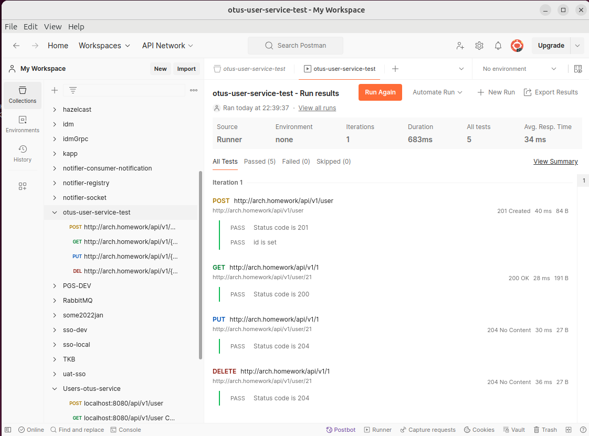

## otus-user-service

Все ресурсы сосредоточены в одном репозитории в учебных целях.

charts в папке  /user-chart  
Документ по helm - см.  /user-chart/README.md

### java service
стек: java-spring-netty-reactor-postgres-liquibase-jooq-openApiGenerator
Параметры сервиса

| ENV VARIABLE     | PURPOSE               |
|------------------|-----------------------|
| USER_DB_USER     | login пользователя db |
| USER_DB_PASSWORD | pass db               |
| USER_DB_PORT     | port db               |
| USER_DB_HOST     | host db               |
| USER_DB_NAME     | database name         |
| USER_DB_SCHEMA   | schema (public)       |

Сервис разворачивает структуру с помощью liquibase при запуске.

Структуры api сервиса генерируются из OpenApi:  
src/main/resources/specification/openapi-users.yaml

### dev
/dev/docker-compose.yaml - для отладки сервиса

### Команды

#### Собрать приложение

Требуется jdk 17  
Приложение будет создано в папке /build/libs
```shell
./gradlew bootJar
```

#### Собрать Dockerfile

```shell
docker build --platform linux/amd64 -t otus-user-service .
```

#### Запустить докер из локально собранного 8080 - minservice/ping

```shell
docker run --name otus-user-service-01 -d -p 8080:8080 otus-user-service
```
#### Тест

```shell
curl --location 'http://localhost:8080/actuator/health'
```

```shell
curl --location 'http://localhost:8080/testservice/ping'
```

#### Опубликовать на dockerhub

Сделать таг для публикации.
```shell
docker tag otus-user-service maxmiracle/otus-user-service:8
```

Или пересобрать с новым тегом.
```shell
docker build --platform linux/amd64 -t maxmiracle/otus-user-service:12 .
```

Опубликовать
```shell
docker push maxmiracle/otus-user-service:12
```

Запустить из dockerhub
```shell
docker run --name otus-user-service-01 -d -p 8888:8080 maxmiracle/otus-user-service:4
```

### Postman collection
https://www.postman.com/maxmiracle/otus-user-service-test/collection/088wihg/otus-user-service-test?action=share&creator=18992670



kubectl port-forward service/my-release-postgresql 15432:5432