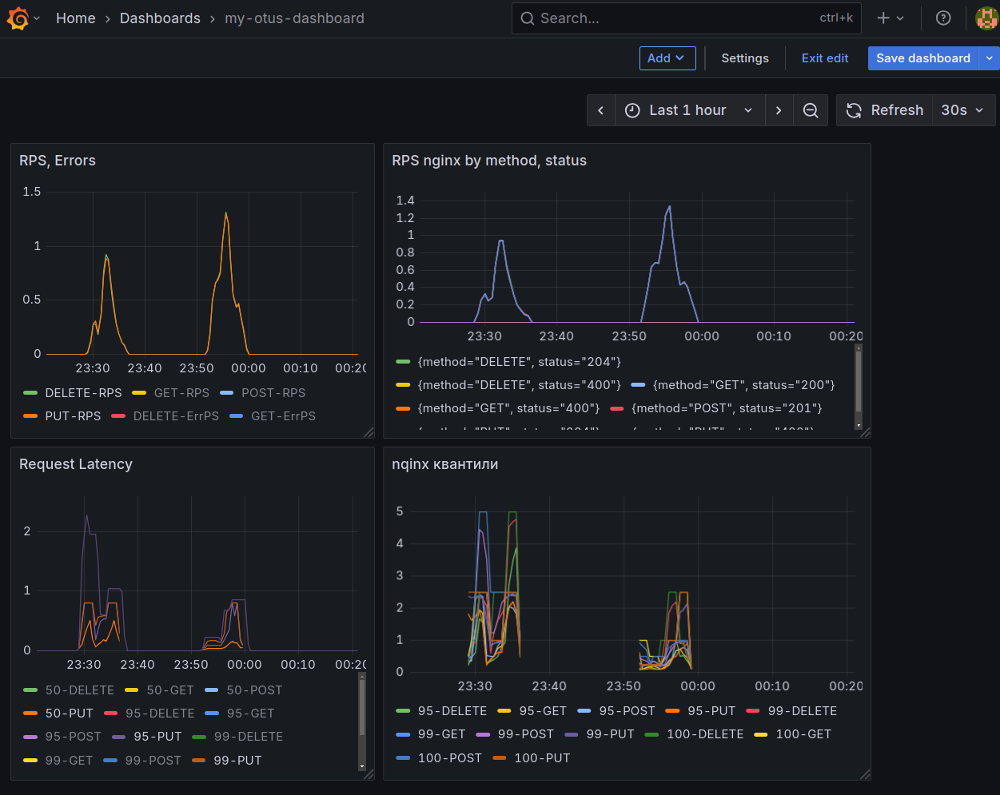

### Отчет по дз PROMETHEUS. 

## Последовательность команд для установки команд в миникубе:

minikube start

helm repo add prometheus-community https://prometheus-community.github.io/helm-charts

helm repo update

cat <<EOF | helm install kube-prometheus-stack prometheus-community/kube-prometheus-stack \
--create-namespace -n monitoring -f -
grafana:
  enabled: true
  adminPassword: "admin"
persistence:
  enabled: true
  accessModes: ["ReadWriteOnce"]
  size: 1Gi
ingress:
  enabled: true
  ingressClassName: nginx
  hosts:
    - grafana.localdev.me
EOF

kubectl get pods -n monitoring

helm upgrade --install ingress-nginx ingress-nginx \
  --repo https://kubernetes.github.io/ingress-nginx \
  --namespace ingress-nginx --create-namespace \
  --set controller.metrics.enabled=true \
  --set controller.metrics.serviceMonitor.enabled=true \
  --set controller.metrics.serviceMonitor.additionalLabels.release="kube-prometheus-stack"

kubectl port-forward service/kube-prometheus-stack-grafana 9000:80 -n monitoring

cd  ./user-chart

helm install my-release .

cat <<EOF | kubectl apply -f -
apiVersion: networking.k8s.io/v1
kind: Ingress
metadata:
  name: arch-ingress
spec:
  ingressClassName: nginx
  rules :
  - host: arch.homework
 
  defaultBackend:
    service:
      name: my-release-user-chart
      port:
        number: 80
EOF

kubectl port-forward -n ingress-nginx service/ingress-nginx-controller 8080:80

kubectl port-forward service/kube-prometheus-stack-grafana 9000:80 -n monitoring

### Metrics
RPS
sum by (uri, method) (rate(http_server_requests_seconds_count{uri=~"/api/v1/user.*"}[$__rate_interval]))

RPS ERROR
sum by (uri, method) (rate(http_server_requests_seconds_count{uri=~"/api/v1/user.*",status=~"[^2].*"}[$__rate_interval]))

Квантили
sum by (uri, method) (rate(http_server_requests_seconds_sum{uri=~"/api/v1/user.*"}[$__rate_interval])) / sum by (uri, method) (rate(http_server_requests_seconds_count{uri=~"/api/v1/user.*"}[$__rate_interval]))

histogram_quantile(0.50, sum by(le, uri, method) (rate(http_server_requests_seconds_bucket{uri=~"/api/v1/user.*"}[$__rate_interval])))

histogram_quantile(0.95, sum by(le, uri, method) (rate(http_server_requests_seconds_bucket{uri=~"/api/v1/user.*"}[$__rate_interval])))

histogram_quantile(0.99, sum by(le, uri, method) (rate(http_server_requests_seconds_bucket{uri=~"/api/v1/user.*"}[$__rate_interval])))

histogram_quantile(1.00, sum by(le, uri, method) (rate(http_server_requests_seconds_bucket{uri=~"/api/v1/user.*"}[$__rate_interval])))

max by (uri, method) (http_server_requests_seconds_max{uri=~"/api/v1/user.*"})

nginx RPS, ERRORS
sum by (method, status) (rate(nginx_ingress_controller_requests[$__rate_interval]))

nginx квантили
histogram_quantile(0.95, sum by(le, method) (rate(nginx_ingress_controller_request_duration_seconds_bucket[$__rate_interval])))

histogram_quantile(0.99, sum by(le, method) (rate(nginx_ingress_controller_request_duration_seconds_bucket[$__rate_interval])))

histogram_quantile(1.00, sum by(le, method) (rate(nginx_ingress_controller_request_duration_seconds_bucket[$__rate_interval])))

# dashboard
Файл c dashboard: ./my-otus-dashboard.json

